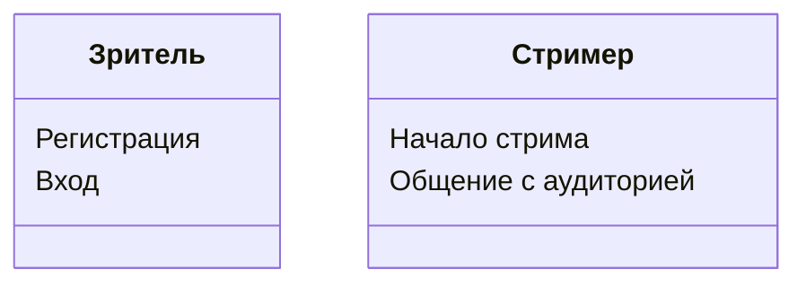
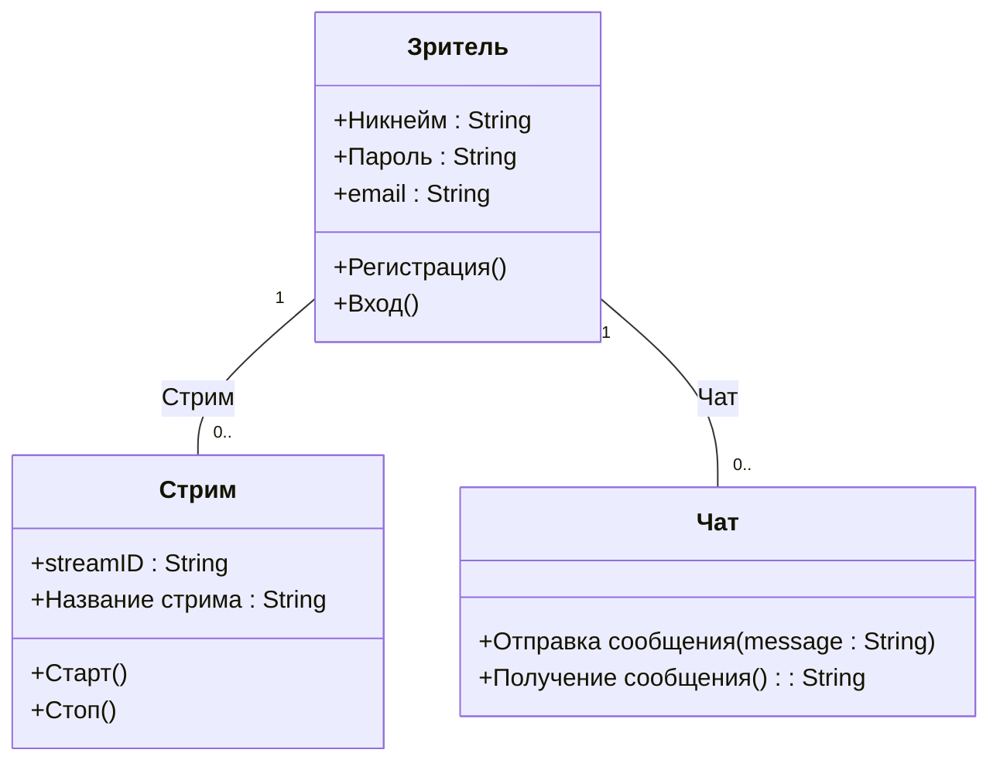
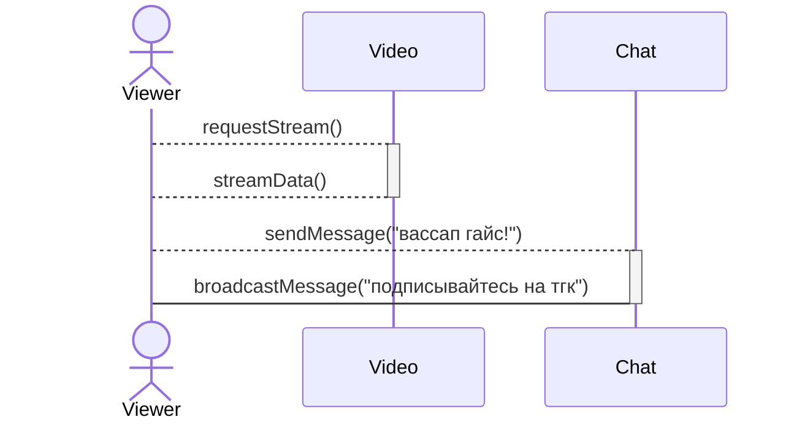

# StreamConnect #
Twitch - это платформа для потокового видео, которая позволяет пользователям транслировать живое видео и взаимодействовать с аудиторией. Эта документация описывает архитектуру и функциональные возможности программного продукта.
## 1) *Диаграмма прецедентов* ##
### Описание ###
Диаграмма отображает группы и то, что каждый из них может получить от платформы в зависимости от роли на данный момент. 
### Группы ###
- Стример
- Зритель

## 2) *Диаграмма классов* ##
### Описание ###
Эта диаграмма классов показывает основные классы системы: Зритель, Стрим и Чат. Она описывает их атрибуты и методы, а также связи между ними, например, пользователь создает поток и участвует в чате.
### Системы ###
- Зритель
- Чат
- Стрим

## 3) *Диаграмма последовательностей* ##
### Описание ###
Диаграмма последовательности иллюстрирует процесс инициации потока пользователем. Взаимодействие между компонентами показано последовательно, демонстрируя, как пользовательский запрос обрабатывается системой.
### Участники ###
- Зритель
- Видео
- Чат
### События ###
1. Зритель открывет понравившееся Видео
2. Сервер обрабатывет запрос
3. Видео открывается для Зрителя
4. Зритель пишет сообщение в Чат
5. Из Чата приходит автоматическое сообщение Зрителю

